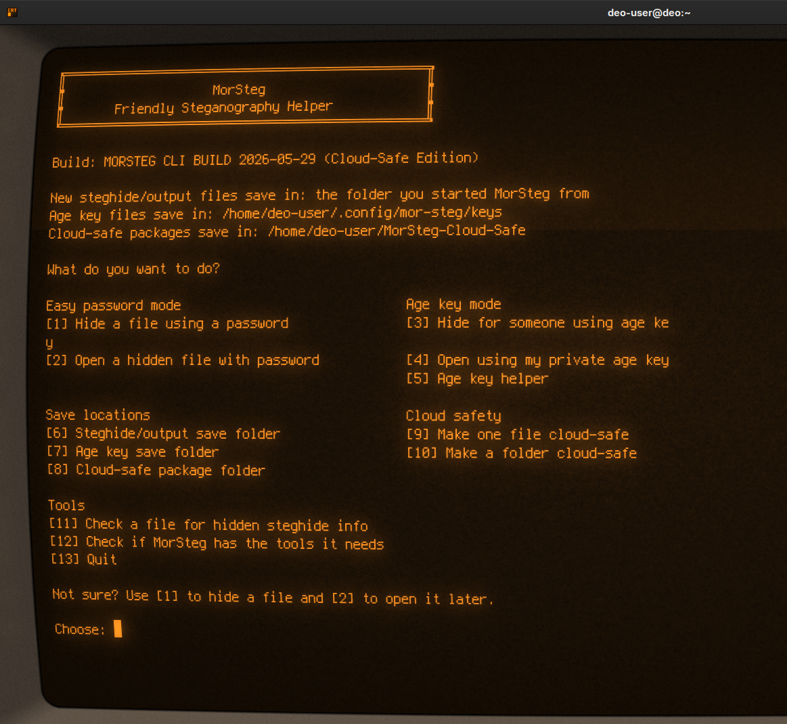
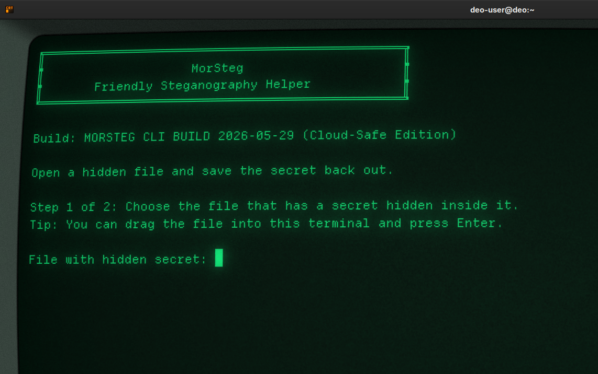
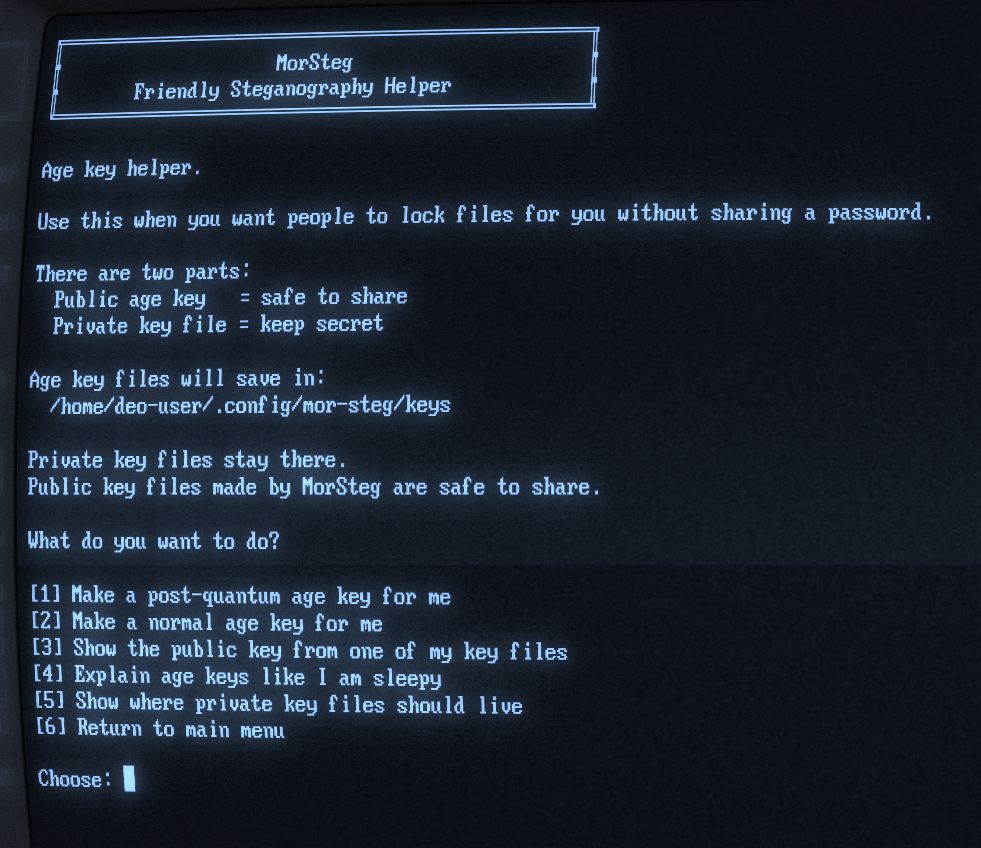
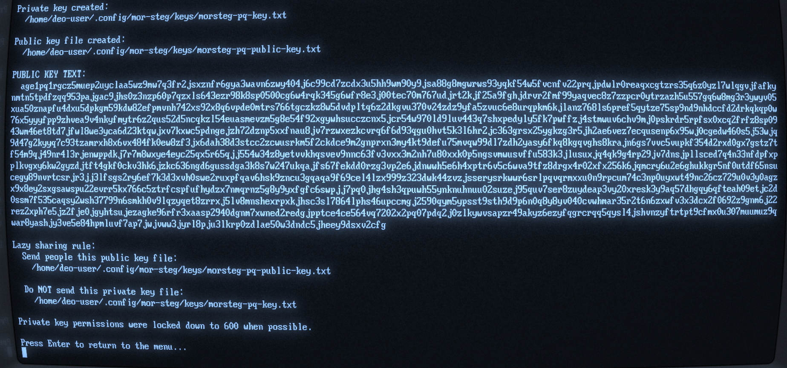
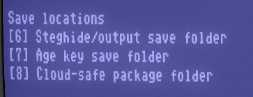
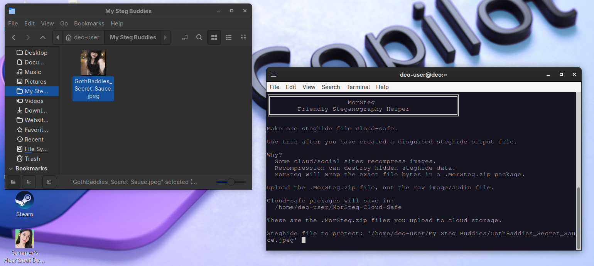
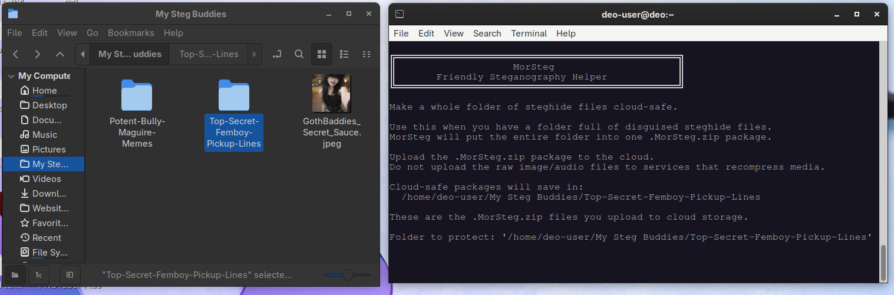
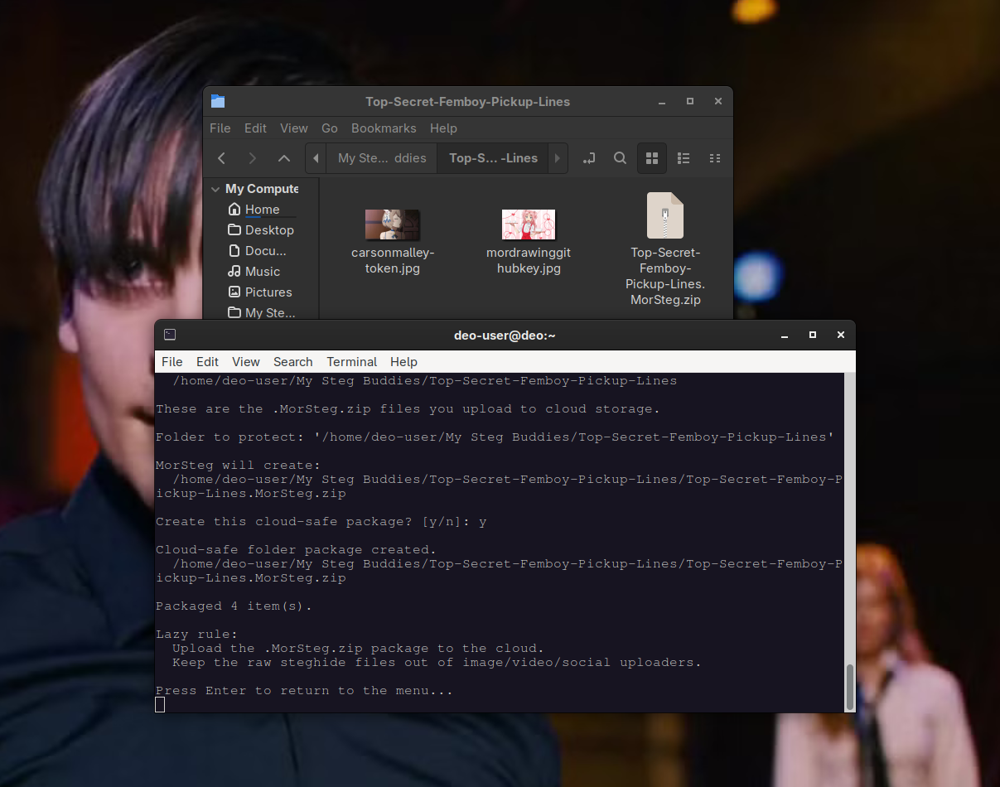
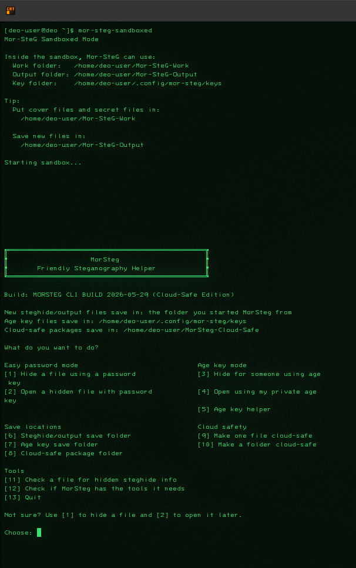

# MorSteg CLI



**MorSteg CLI** is a noob-friendly terminal helper for hiding encrypted files inside normal-looking image or audio files.

It combines three layers:

```text
age       = encrypts the secret
steghide  = hides the encrypted payload inside a cover file
MorSteg   = gives you a plain-English menu so you do not have to memorize commands
```

MorSteg is made for lazy people, nervous people, and anyone who does not want to remember command flags.

---

## Highlights

- Plain-English terminal menu
- Password-based hiding and opening
- Age public/private key workflow
- Post-quantum-capable age recipient workflow
- Automatic public age key file creation
- Cloud-safe `.MorSteg.zip` packages
- Separate save folders for outputs, age keys, and cloud-safe packages
- Optional Bubblewrap sandbox launcher
- Linux packages for Arch, Debian/Ubuntu, RPM-based distros, plus a portable tarball

---

## Screenshot tour

### Friendly main menu


MorSteg uses a simple menu instead of making you memorize commands.

### Hide a file with a password



The password flow walks through the cover file, secret file, and output file.

### Age key helper



Age keys are for hiding files for someone else without sharing a password.

```text
public age key     = safe to share
private key file   = keep secret
```

### Public key file creation



MorSteg can create a separate public key file automatically, so you do not have to copy a giant key out of the terminal.

### Separate save locations



MorSteg can keep different things in different places:

```text
steghide/output files
age key files
cloud-safe packages
```

### Cloud-safe single-file packaging



A raw steghide image/audio file can break if a cloud or social service recompresses it. MorSteg can wrap the file in a `.MorSteg.zip` package so the bytes are preserved.

### Cloud-safe folder packaging



You can also package a whole folder of steghide files at once.

### Cloud-safe output package



Upload the `.MorSteg.zip` file to cloud storage instead of uploading the raw steghide image/audio file to a service that might recompress it.

### Optional sandboxed launcher



The optional Bubblewrap launcher runs MorSteg in a smaller fenced-off environment.

---

## What MorSteg does

MorSteg helps you:

- hide a secret file using a password
- open a hidden file using a password
- hide a file for someone else using their public age key
- open a file using your private age key file
- make and manage age keys
- make steghide files cloud-safe with `.MorSteg.zip` packages
- choose separate save folders for outputs, keys, and cloud-safe packages
- optionally run through a Bubblewrap sandbox launcher

---

## What MorSteg does not do

MorSteg does **not** invent its own cryptography.

It wraps trusted local tools:

```text
age
steghide
```

MorSteg also does **not** upload files anywhere. There is no networking, no telemetry, no auto-updater, and no plugin system.

---

## Install dependencies

MorSteg needs `age` and `steghide`.

### Arch Linux

```bash
sudo pacman -S age
paru -S steghide
```

or:

```bash
sudo pacman -S age
yay -S steghide
```

Optional sandbox launcher:

```bash
sudo pacman -S bubblewrap
```

### Debian / Ubuntu

```bash
sudo apt install age steghide
```

Optional sandbox launcher:

```bash
sudo apt install bubblewrap
```

---

## Install from release packages

The GitHub release may include:

```text
mor-steg-0.2.0-x86_64-unknown-linux-gnu.tar.zst
mor-steg_0.2.0-1_amd64.deb
mor-steg-0.2.0-1.x86_64.rpm
mor-steg-0.2.0-1-x86_64.pkg.tar.zst
SHA256SUMS
```

### Arch package

```bash
sudo pacman -U ./mor-steg-0.2.0-1-x86_64.pkg.tar.zst
```

### Debian / Ubuntu package

```bash
sudo apt install ./mor-steg_0.2.0-1_amd64.deb
```

### RPM package

```bash
sudo dnf install ./mor-steg-0.2.0-1.x86_64.rpm
```

### Portable tarball

```bash
tar --use-compress-program=unzstd -xf mor-steg-0.2.0-x86_64-unknown-linux-gnu.tar.zst
cd mor-steg-0.2.0-x86_64-unknown-linux-gnu
./mor-steg
```

---

## Build from source

```bash
git clone https://github.com/MoribundMurdoch/mor-steg-cli.git
cd mor-steg-cli
cargo build --release
```

Run from source:

```bash
cargo run
```

Run the built binary:

```bash
./target/release/mor-steg
```

---

## Verify release downloads

Download `SHA256SUMS` from the release page and run:

```bash
sha256sum -c SHA256SUMS
```

If a signature file is provided, verify it with:

```bash
gpg --verify SHA256SUMS.asc SHA256SUMS
```

---

## Basic workflow: hide a file with a password

Use this when you want the simplest workflow.

```text
[1] Hide a file using a password
```

MorSteg asks for:

```text
cover file    = normal-looking image/audio file
secret file   = file you want to hide
output file   = disguised file to create
```

MorSteg then does:

```text
secret file
  -> age password encryption
  -> encrypted payload
  -> steghide embeds payload into cover file
  -> disguised output file
```

To open it later:

```text
[2] Open a hidden file with password
```

---

## Age key workflow

Age keys are useful when you want someone else to hide a file for you without sharing a password.

An age key has two parts:

```text
public age key     = safe to share
private key file   = keep secret
```

Use:

```text
[5] Age key helper
```

MorSteg can make:

```text
morsteg-pq-key.txt
morsteg-pq-public-key.txt
```

Meaning:

```text
morsteg-pq-key.txt          private, do not share
morsteg-pq-public-key.txt   public, safe to share
```

The lazy rule:

```text
Send people the public key file.
Never send the private key file.
```

---

## Post-quantum-capable wording

MorSteg is **post-quantum-capable** when used with a new enough `age` build and post-quantum age recipient keys.

MorSteg does **not** implement post-quantum cryptography itself.

Honest model:

```text
age       = encryption layer
steghide  = hiding layer
MorSteg   = friendly workflow layer
```

Do not describe this as “quantum-proof steghide.” Steghide is not the post-quantum part.

Better wording:

```text
Post-quantum-capable through age PQ recipient keys.
```

---

## Cloud-safe packages

Steghide carrier files are fragile if a site modifies them.

Bad things for a raw steghide image/audio file:

```text
image recompression
resize
conversion to WebP
audio conversion
media optimization
```

MorSteg can make a `.MorSteg.zip` package:

```text
[9] Make one file cloud-safe
[10] Make a folder cloud-safe
```

A cloud-safe package is for **byte preservation**, not extra encryption.

Use it like this:

```text
1. Hide a secret with MorSteg.
2. Make the steghide output cloud-safe.
3. Upload the .MorSteg.zip package.
4. Download it later.
5. Extract the original carrier file.
6. Open it with MorSteg.
```

Inside a `.MorSteg.zip` package:

```text
files/
README_MorSteg_Cloud_Safe.txt
manifest_MorSteg.txt
```

Upload the `.MorSteg.zip` file to cloud storage.

Do not upload the raw steghide image/audio file to services that recompress media.

---

## Optional sandboxed mode

If installed from the packaged release, MorSteg may include:

```bash
mor-steg
mor-steg-sandboxed
```

The sandboxed launcher uses Bubblewrap.

It gives MorSteg a smaller fenced-off area to work in. This is useful because MorSteg launches local tools like `age` and `steghide`.

Sandboxed mode is containment, not magic armor.

---

## Packaging

This repository includes packaging support for:

```text
Arch / pacman
Debian / Ubuntu
RPM
Nix
portable Linux tarball
```

Local release build:

```bash
bash scripts/release-local.sh 0.2.0
```

Artifacts are placed in:

```text
dist/
```

---

## Development notes

MorSteg is intentionally boring in the right places.

Security choices:

- use `std::process::Command`
- do not build shell command strings
- do not log passwords
- do not add networking
- do not add telemetry
- keep the CLI small enough to audit
- rely on `age` for encryption
- rely on `steghide` for hiding

The project currently uses a small dependency set. `tempfile` is used for safer temporary workspaces.

---

## License

MorSteg's own source code, documentation, packaging scripts, and project files are licensed under **GPL-3.0-or-later**.

Third-party tools and crates used with MorSteg remain under their own licenses. MorSteg does not relicense `age`, `steghide`, `bubblewrap`, Rust crate dependencies, operating-system packages, or build tools.

See:

See:

```text
LICENSE
THIRD_PARTY_NOTICES.md
```
